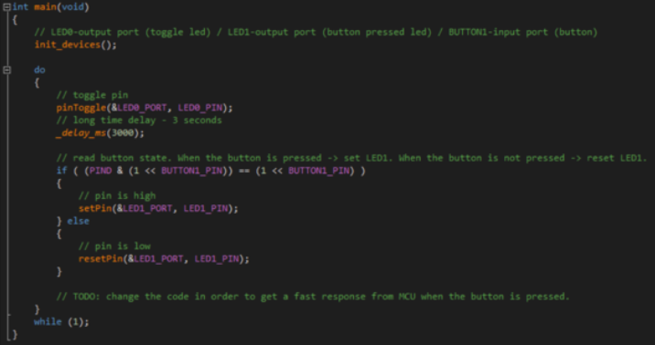

# Interrupts Applications
## App 1

**There are two LEDs and one BUTTON. Each 3 seconds, the first LED (LED0) will be toggled.
In parallel, if the BUTTON is pressed, the second LED (LED1) will be turned ON and when the BUTTON
is released, the LED1 will be turned OFF.**

**Requirements:**
1. Detect which is the main problem of the program;
2. Change the program's functionality in order to eliminate the problem

## App 2

Use two buttons to command 4 LEDs. 
Initially, all 4 LEDs will be powered-on. If the first button will be pressed, all the LEDs will be
turned OFF. After this, if the second button will be pressed, all the LEDs will be turned ON.

**If in the initially state, the second button will be pressed, the LEDs will remain turned ON.**
